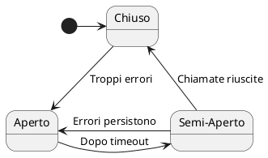
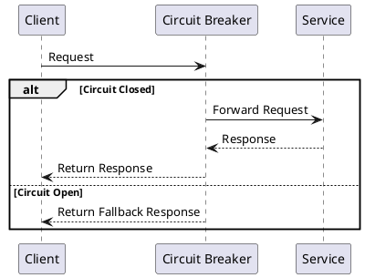

Nell'ingegneria del software, la resilienza dei sistemi è fondamentale, soprattutto quando si tratta di servizi ad alta disponibilità. Oggi esploreremo un pattern di progettazione che ha rivoluzionato la gestione del carico in sistemi distribuiti: il Circuit Breaker.

## La Storia di un Quasi Disastro

Immaginate la scena: un importante servizio di streaming (che chiameremo "StreamFlix") si prepara al lancio di una nuova serie TV attesissima. L'hype è alle stelle, i fan sono pronti a premere play... ma c'è un problema. Il traffico imprevisto rischia di mandare in tilt i server.

Cosa fare? Ecco che entra in gioco il nostro eroe: il Circuit Breaker pattern.

## Come Funziona il Circuit Breaker

Il Circuit Breaker è un pattern intelligente che monitora le chiamate ai servizi e reagisce in modo proattivo quando rileva problemi. Ecco una rappresentazione visiva del suo funzionamento:



1. **Stato Chiuso**: In condizioni normali, il circuit breaker lascia passare tutte le richieste.
2. **Monitoraggio**: Tiene traccia del numero di errori o timeout.
3. **Apertura del Circuito**: Se il numero di errori supera una soglia, il circuito si "apre".
4. **Gestione del Traffico**: Le richieste vengono reindirizzate o gestite con risposte di fallback.
5. **Recupero**: Dopo un periodo prestabilito, il circuito passa in uno stato "semi-aperto" per testare il servizio.
6. **Ritorno alla Normalità**: Se le chiamate di test hanno successo, il circuito si chiude nuovamente.

## L'Implementazione che ha Salvato StreamFlix

Tornando alla nostra storia, StreamFlix ha implementato il Circuit Breaker pattern nei suoi sistemi critici. Il risultato? Un'infrastruttura capace di gestire picchi di traffico del 300% senza downtime. La premiere della serie TV è stata un successo strepitoso, senza interruzioni di servizio.

Ecco come potrebbe apparire una semplice implementazione del pattern:



## Implementazione Pratica

Per gli sviluppatori che vogliono implementare questo pattern, esistono librerie che semplificano notevolmente il processo. Una delle più note è Hystrix, sviluppata proprio da Netflix. Ecco un esempio semplificato di come potrebbe apparire l'uso di Hystrix:

```java
public class ServiceCommand extends HystrixCommand<String> {
    private final String name;

    public ServiceCommand(String name) {
        super(HystrixCommandGroupKey.Factory.asKey("ExampleGroup"));
        this.name = name;
    }

    @Override
    protected String run() {
        // Chiamata al servizio che potrebbe fallire
        return "Hello " + name + "!";
    }

    @Override
    protected String getFallback() {
        return "Hello Guest!";
    }
}

// Uso
String result = new ServiceCommand("World").execute();
```

## Conclusioni e Riflessioni

Il Circuit Breaker pattern è un esempio brillante di come l'ingegneria del software possa risolvere problemi complessi con eleganza. Non solo previene il collasso dei sistemi sotto carico, ma migliora anche l'esperienza utente fornendo risposte di fallback invece di errori.

Ma come ogni soluzione, porta con sé nuove sfide. La configurazione dei parametri del circuit breaker (soglie di errore, tempi di timeout) richiede una profonda comprensione del sistema e del suo comportamento sotto stress.

**Domanda per i lettori**: Avete mai implementato il Circuit Breaker nei vostri progetti? Quali sfide avete incontrato e come le avete superate?

Restate sintonizzati! La prossima settimana esploreremo un altro pattern che potrebbe rivoluzionare il vostro prossimo progetto software. Non perdetevelo!
